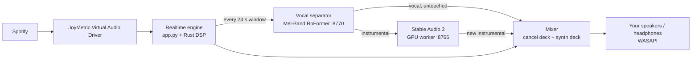

# JoyMetric VocalWeave

JoyMetric is a Windows desktop music workstation that **remixes a song live while it plays**.

You play a track in Spotify (or any app). JoyMetric captures the audio, splits the vocal from the
instrumental, and sends the instrumental through **Stable Audio 3**, guided by a text prompt such as
*"dark trap with heavy 808s"*. The vocal is left exactly as it is. The new instrumental replaces the
original one sample for sample, so you hear the original singer over a re-imagined backing track, with
no gaps.

It also has an offline **Home** mode: upload a song, pick a prompt, and get a transformed full-length
file back.

> Current build: **v31.30.39**. Per-version change notes are in the `README_V*.md` files.

---

## Contents

1. [How it works](#how-it-works)
2. [The parts of the software](#the-parts-of-the-software)
3. [Requirements](#requirements)
4. [Installation (Windows PowerShell)](#installation-windows-powershell)
5. [Starting the app (Windows PowerShell)](#starting-the-app-windows-powershell)
6. [Using it](#using-it)
7. [Checking that everything is healthy](#checking-that-everything-is-healthy)
8. [Stopping it](#stopping-it)
9. [Configuration](#configuration)
10. [Troubleshooting](#troubleshooting)

---

## How it works

### The live path ("Realtime Weave")



1. **Capture.** Spotify plays into the *JoyMetric Virtual Audio Driver*, a small kernel audio
   driver that loops the sound into the app. The app reads it in 4096-sample blocks.
2. **Buffer.** Playback runs **48 seconds behind** the live input. That delay is the time budget the
   AI needs. The song is cut into **24-second windows**.
3. **Separate.** Each window is sent to the separation worker, which splits it into *vocal* and
   *instrumental* (about 1.5–3 s per window).
4. **Transform.** The instrumental goes to the Stable Audio 3 worker as an audio-to-audio edit:
   - the text prompt says what the new instrumental should sound like;
   - **STABLE TEMP** (the diffusion *init noise*) sets how far it may move away from the original;
   - **STABLE FX** (*cfg*, prompt guidance) sets how strongly the prompt is followed;
   - the last **8 seconds of the previous window's output** are given to the model as known audio
     (inpainting), so each window continues smoothly from the one before.
5. **Guard.** The result is compared with the original instrumental (chroma and rhythm). If the
   harmony or rhythm has drifted too far, the window is generated once more with gentler settings,
   and the better of the two is kept. Quiet input is boosted before the model sees it, then scaled
   back afterwards, because quiet audio is otherwise transformed much more aggressively.
6. **Replace.** The engine subtracts the original instrumental from the output ("cancel deck") and
   adds the new one ("synth deck"), with short cross-fades at the window edges. The vocal is
   never processed by the model.
7. **Play.** The mix goes to the output device you picked in the UI.

Measured on the development laptop (RTX 5070 Laptop, 8 GB): about 9 s of GPU work per 24 s
window, with no late windows and no audio dropouts.

### The offline path ("Home")

`processor.py` takes an uploaded file, separates it with the same RoFormer model, runs the whole
instrumental through Stable Audio 3 (split into chunks if the song is long), and writes the results
to `runtime/jobs/<id>/`. Results can be saved to the local library (`library_store.py`).

---

## The parts of the software

JoyMetric runs as **one web app plus several background worker processes**. Each worker is a
small HTTP server on `127.0.0.1`, so a heavy AI model loads once and stays in memory.

| Process | Port | Python env | What it does |
|---|---|---|---|
| `app.py` (Flask) | **8765** | `roformer_sep` | Web UI, REST API, realtime audio engine, Home jobs |
| `workers/sa3_persistent_server.py` | 8766 | `stableaudio3_gpu` | Stable Audio 3 medium on the GPU. Started and supervised by the app (`gpu_engine.py`) |
| `realtime_semantic_server.py` | 8767 | `semantic_clap_cpu` | CLAP audio/text model on the CPU. Scores how well audio matches the prompt |
| `workers/amt_persistent_server.py` | 8769 | `stableaudio3_gpu` | Symbolic melody models (AMT + SongMind). **Off by default** (`JOY_GEN_AI=0`) |
| `workers/sep_persistent_server.py` | 8770 | `roformer_sep` | Mel-Band RoFormer vocal separation for the live path |
| `worker_watchdog.ps1` | – | PowerShell | Restarts the semantic worker if it dies; kills duplicates |
| `monitor_sa3.py` | – | any Python | Optional read-only health monitor; writes one line every 10 s |

### Source files

| Area | Files |
|---|---|
| **Web app and API** | `app.py`, `templates/index.html`, `static/app.js`, `static/app.css`, `desktop_loading.html` |
| **Realtime engine** | `realtime_native_engine.py` (capture, playback bridge, decks, mixer), `rust_dsp.py` + `native/` (Rust DSP DLL, `joymetric_rt.dll`), `beat_clock.py` |
| **Live remix agent** | `agentic_live_dj.py` (session loop, music analysis, runs the weave), `vocal_weave.py` (separate, transform, guard, schedule, cross-fade) |
| **GPU worker management** | `gpu_engine.py` (starts the SA3 worker, with restart backoff and a memory gate), `workers/sa3_persistent_server.py` (low-memory streaming model loader), `workers/sa3_fullsong_worker.py` |
| **Offline processing** | `processor.py`, `library_store.py`, `cover_cache.py` |
| **Music intelligence** | `musical_intelligence.py`, `line_finder.py`, `genre_probe.py`, `timbre_select.py` |
| **Legacy DJ controller** (disabled by default; `JOY_DJ_CONTROLLER=1` turns it back on) | `dj_director_v3.py`, `block_planner.py`, `drum_brain.py`, `drum_kit.py`, `synth_rack.py`, `synth_weave.py`, `gen_composer.py`, `groove_*.py`, `melody_net.py`, `songmind_model.py` |
| **Trained model weights** | `models/*.npz`, `models/songmind.pt` (small in-house models; Stable Audio and RoFormer weights are **not** included) |
| **Virtual audio driver** | `driver/` (patch and build tooling), `INSTALL_JOYMETRIC_DRIVER.ps1`, `DRIVER_DIAGNOSTIC.ps1`, `SETUP_AND_START.ps1` |
| **Launchers** | `LAUNCH_SONGMIND.ps1` (main), `LAUNCH_MID.ps1` / `LAUNCH_LOWLAT.ps1` / `LAUNCH_ULTRALOW.ps1` (shorter delays, lower quality), `LAUNCH_DESKTOP_APP.ps1` / `.vbs` (desktop window), `start.ps1` (older launcher) |
| **Utilities** | `monitor_sa3.py`, `SET_PAGEFILE_32GB.ps1`, `check_engine.ps1`, `probe_gpu.ps1` |

---

## Requirements

- **Windows 10 or 11**, 64-bit.
- **NVIDIA GPU with at least 8 GB of VRAM** and a recent driver. Development was done on an RTX 5070 Laptop.
- **At least 16 GB of RAM** (24 GB or more recommended). Loading Stable Audio needs about 13 GB of
  memory for a short time, so a large page file helps (see `SET_PAGEFILE_32GB.ps1`).
- **Miniconda** (or Anaconda).
- **Git**. **Rust** is needed only if you want to rebuild `native/joymetric_rt.dll`.
- Access to the **Stable Audio 3 medium** model on Hugging Face
  (`stabilityai/stable-audio-3-medium`), plus the `stable_audio_3` Python package from the
  Stable Audio 3 repository. Both are under Stability AI's own licence and are not part of this repo.
- The **Windows Driver Kit** and test-signing, only if you build the virtual audio driver yourself.

> **Paths:** the launchers and `config.json` contain absolute paths from the development machine
> (`C:\Users\inceo\miniconda3\...`, `C:\Users\inceo\music_rec\stable-audio-3`). On another machine,
> search and replace them with your own paths before the first run:
>
> ```powershell
> Select-String -Path *.ps1, config.json -Pattern 'C:\\Users\\inceo' | Select-Object Path, LineNumber
> ```

---

## Installation (Windows PowerShell)

Open **Windows PowerShell** and run the steps in order.

### 1. Allow local scripts (once per user)

```powershell
Set-ExecutionPolicy -Scope CurrentUser -ExecutionPolicy RemoteSigned
```

### 2. Get the code

```powershell
cd $env:USERPROFILE\music_rec
git clone https://github.com/emrei1/JoyMetric-VocalWeave.git
cd JoyMetric-VocalWeave
```

### 3. Create the Python environments

The app uses three isolated environments, so the heavy AI stacks do not conflict with each other.

```powershell
# a) App + vocal separation (Flask, audio I/O, Mel-Band RoFormer)
conda create -y -n roformer_sep python=3.10
conda activate roformer_sep
pip install torch --index-url https://download.pytorch.org/whl/cu128
pip install flask werkzeug imageio-ffmpeg numpy soundfile scipy librosa psutil PyAudioWPatch "pedalboard>=0.9.23,<0.10"
# plus the Mel-Band RoFormer package that provides `mel_band_roformer.clean_api` (used by workers/sep_persistent_server.py)
conda deactivate

# b) Stable Audio 3 on the GPU
conda create -y -n stableaudio3_gpu python=3.10
conda activate stableaudio3_gpu
pip install torch --index-url https://download.pytorch.org/whl/cu128
pip install -e C:\path\to\stable-audio-3          # the Stable Audio 3 repository
huggingface-cli login                             # needed once to download the model
conda deactivate

# c) CLAP semantic model on the CPU (a plain venv under LOCALAPPDATA)
python -m venv "$env:LOCALAPPDATA\JoyMetric\envs\semantic_clap_cpu"
& "$env:LOCALAPPDATA\JoyMetric\envs\semantic_clap_cpu\Scripts\pip.exe" install torch transformers flask numpy soundfile
```

`install.ps1` re-checks the app environment's web dependencies at any time:

```powershell
.\install.ps1
```

### 4. Install the virtual audio driver (once, as Administrator)

The driver is how Spotify's audio reaches JoyMetric. Run this in an **elevated** PowerShell
("Run as administrator"):

```powershell
.\INSTALL_JOYMETRIC_DRIVER.ps1 -BootstrapTools
```

It downloads Microsoft's audio driver sample, patches it, builds it, and installs it. It is a
test-signed development driver, so Windows must allow test signing. If Secure Boot blocks that,
see `driver/README_DRIVER.md`. Check the result with:

```powershell
.\DRIVER_DIAGNOSTIC.ps1
```

### 5. (Recommended) Set a larger page file

Run as Administrator, then reboot:

```powershell
.\SET_PAGEFILE_32GB.ps1
```

---

## Starting the app (Windows PowerShell)

### Option A: main launcher (recommended)

```powershell
cd $env:USERPROFILE\music_rec\JoyMetric-VocalWeave
powershell -NoProfile -ExecutionPolicy Bypass -File .\LAUNCH_SONGMIND.ps1
```

The launcher:

1. sets Windows power settings for full performance (on battery too);
2. stops any old JoyMetric app and workers, and waits until they are gone;
3. starts the CLAP semantic worker (:8767) and waits for it;
4. starts the vocal separation worker (:8770) and waits for it;
5. starts `app.py` (:8765). The app then starts the Stable Audio worker (:8766) by itself; the model
   takes about 25–60 s to load;
6. starts the watchdog.

When it prints `launch complete`, open **http://127.0.0.1:8765** in a browser.

### Option B: desktop window

```powershell
.\LAUNCH_DESKTOP_APP.vbs
```

This opens the UI as a borderless Edge app window. If the backend is not running yet, it starts
`LAUNCH_SONGMIND.ps1` for you. A desktop shortcut pointing to this `.vbs` file works the same way.

> If an older JoyMetric backend is already answering on port 8765, the window opens onto **that**
> one. To switch builds, run the new folder's `LAUNCH_SONGMIND.ps1` first. It stops the old stack.

### Option C: shorter delay profiles

Use these to try less delay. Shorter windows give audibly rougher transitions.

| Launcher | Delay | Window |
|---|---|---|
| `LAUNCH_SONGMIND.ps1` | 48 s | 24 s (best quality) |
| `LAUNCH_MID.ps1` | 20 s | 8 s |
| `LAUNCH_LOWLAT.ps1` | 10 s | 4 s |
| `LAUNCH_ULTRALOW.ps1` | 4 s | 2 s |

---

## Using it

1. In Spotify, set the output device to **JoyMetric Virtual Input** and start playing.
2. In the JoyMetric UI, open **Realtime Weave** and pick your speakers or headphones as the output.
3. Type a prompt, for example `very hard trappish hiphop`.
4. Press **LET'S GO**. The first transformed audio is heard after about 16 seconds.
5. Adjust the sliders while it plays. Each change applies from the next window:
   - **STABLE TEMP**: how much the instrumental may change. Around 0.45–0.55 keeps the melody;
     above about 0.65 the melody starts to get lost.
   - **STABLE FX**: how strongly the prompt is followed (minimum 2.0). Values that are too high
     make it harsher and less faithful.
6. Press **STOP** to end the session.

For the offline mode, open **Home**, upload a song, choose the settings, and start a job.

### Starting a session from PowerShell

```powershell
# list output devices and find the id of your speakers
(Invoke-RestMethod http://127.0.0.1:8765/api/agentic/devices) | ConvertTo-Json -Depth 4

# start
$body = @{ output_id = "63"; prompt = "very hard trappish hiphop"; autonomy = "autopilot"; creativity = 0.5 } | ConvertTo-Json
Invoke-RestMethod -Method Post -Uri http://127.0.0.1:8765/api/agentic/start -ContentType 'application/json' -Body $body

# change the sliders live
Invoke-RestMethod -Method Post -Uri http://127.0.0.1:8765/api/agentic/weave -ContentType 'application/json' -Body '{"noise":0.5}'

# stop
Invoke-RestMethod -Method Post -Uri http://127.0.0.1:8765/api/agentic/stop
```

Device ids change between reboots and when Bluetooth devices reconnect. Always look the id up again.

---

## Checking that everything is healthy

```powershell
# the app and the weave
$s = Invoke-RestMethod http://127.0.0.1:8765/api/agentic/status
$s.running; $s.realtime.xruns; $s.synth_ai.weave

# each worker
foreach ($p in 8766, 8767, 8770) {
    try { "{0}: {1}" -f $p, (Invoke-RestMethod "http://127.0.0.1:$p/health" -TimeoutSec 3 | ConvertTo-Json -Compress) }
    catch { "{0}: not answering" -f $p }
}

# exactly one Stable Audio process should be on the GPU
nvidia-smi --query-compute-apps=pid,used_memory --format=csv
```

What a healthy system looks like: exactly **one** Stable Audio worker, `xruns` staying at 0 during
playback, and the weave window count going up with none failing.

Optional continuous monitor (logs to `%LOCALAPPDATA%\JoyMetric\logs\monitor_sa3.log`):

```powershell
& "$env:USERPROFILE\miniconda3\envs\roformer_sep\python.exe" .\monitor_sa3.py
# stop it: New-Item runtime\monitor_stop
```

Logs are in `%LOCALAPPDATA%\JoyMetric\logs\` and `runtime\sa3_engine.log`.

---

## Stopping it

```powershell
# stop the session
Invoke-RestMethod -Method Post -Uri http://127.0.0.1:8765/api/agentic/stop

# shut everything down: the app first, then the workers (otherwise the app restarts the GPU worker)
Get-NetTCPConnection -LocalPort 8765 -State Listen -ErrorAction SilentlyContinue |
    ForEach-Object { Stop-Process -Id $_.OwningProcess -Force }
Get-CimInstance Win32_Process | Where-Object {
    $_.Name -like 'python*.exe' -and $_.CommandLine -match 'sa3_persistent_server|sep_persistent_server|realtime_semantic_server|amt_persistent_server'
} | ForEach-Object { Stop-Process -Id $_.ProcessId -Force }
Get-CimInstance Win32_Process | Where-Object { $_.CommandLine -like '*worker_watchdog.ps1*' } |
    ForEach-Object { Stop-Process -Id $_.ProcessId -Force }
```

Running `LAUNCH_SONGMIND.ps1` again also cleans up any old processes before it starts.

---

## Configuration

**`config.json`** holds the conda path, environment names, ports and Home-mode chunking.

**`%LOCALAPPDATA%\JoyMetric\weave.json`** stores the live slider values. The UI writes it, and it is
read again for every window:

```json
{ "noise": 0.52, "cfg": 4.0, "speed": "turbo", "amount": 1.0 }
```

Optional keys: `"guard": 0` turns the harmony guard off; `"input_rms": 0` turns input level
normalisation off.

**Environment variables** (set in the launchers) that are useful to know:

| Variable | Default | Meaning |
|---|---|---|
| `JOY_AGENTIC_LOOKAHEAD_SEC` | 48 | Playback delay behind the live input |
| `JOY_WEAVE_PROFILE` | *(normal)* | `mid` / `lowlat` / `ultralow` window profiles |
| `JOY_AGENTIC_AUDIO_FRAMES` | 4096 | Capture block size |
| `JOY_BRIDGE_BLOCKS` | 14 | Output cushion (keep at 14; much higher values broke playback) |
| `JOY_SA3_MEM_FRACTION` | 0.70 | Share of GPU memory Stable Audio may use |
| `JOY_WEAVE_GUARD_CHROMA` / `_ONSET` | 0.86 / 0.60 | Harmony guard thresholds |
| `JOY_WEAVE_INPUT_RMS` | 0.35 | Input level target for the model (0 = off) |
| `JOY_SA3_MIN_COMMIT_GB` | 12 | Free memory required before (re)loading Stable Audio |
| `JOY_GEN_AI` | 0 | 1 = start the symbolic melody worker |
| `JOY_DJ_CONTROLLER` | 0 | 1 = bring back the legacy DJ controller |
| `JOY_DSP_FX` | 0 | 1 = turn the CLAP-driven StudioDSP effects chain back on |

---

## Troubleshooting

| Symptom | Likely cause and fix |
|---|---|
| No sound at all | The output device changed or is disconnected, or Windows' default output is a virtual cable. Pick the real speakers in the UI and press LET'S GO again. The device choice only applies when a session starts. |
| "JoyMetric Virtual Audio Driver is not installed" | Run step 4 of the installation, then `DRIVER_DIAGNOSTIC.ps1`. |
| Stable Audio part sometimes missing | Check that exactly one SA3 process is on the GPU (`nvidia-smi`). Look in `runtime\sa3_engine.log` for `error 1455` (page file too small), then run `SET_PAGEFILE_32GB.ps1`. |
| Transformed sound is dull or barely changes | STABLE FX is too low. Raise it to about 3–4. |
| Melody gets lost or sounds garbled | STABLE TEMP is too high. Lower it to about 0.45–0.55. |
| Crackles or dropouts | Other heavy CPU or GPU work is running, or the laptop is on battery. Check `realtime.xruns`, and run the launcher again (it sets the power plan and process priorities). |
| CUDA out of memory in Home right after a live session | Press STOP, close the app, and start it again with the launcher. |

---

## Credits and licences

- **Stable Audio 3** by Stability AI (model and code under Stability AI's licence, not included).
- **Mel-Band RoFormer** vocal separation model.
- **CLAP** (`laion/clap-htsat-unfused`, `laion/larger_clap_music`) via Hugging Face Transformers.
- **Anticipatory Music Transformer** (Stanford CRFM), used by the optional melody worker.
- The virtual audio driver is built on Microsoft's
  [Windows-driver-samples](https://github.com/microsoft/Windows-driver-samples) *Simple Audio Sample*
  (MS-PL). See `driver/NOTICE.txt`.
